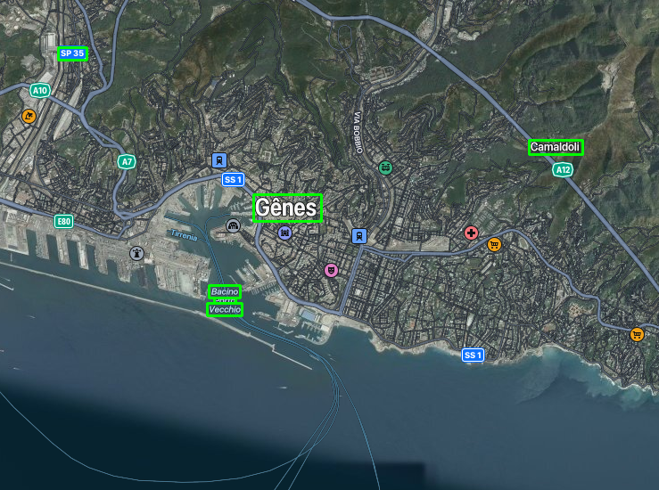

# OCR avec détection de texte et sortie JSON

Ce script Python utilise OpenCV et EasyOCR pour détecter le texte dans une image, dessiner des rectangles autour du texte détecté, et produire une sortie au format JSON avec les informations sur le texte détecté.

## Installation des dépendances

Avant d'exécuter le script, assurez-vous d'avoir installé les dépendances suivantes :

- `opencv-python`: Utilisé pour le traitement d'images.
- `easyocr`: Utilisé pour la reconnaissance optique de caractères.

Vous pouvez installer les dépendances en exécutant la commande suivante dans votre environnement Python :

```
pip install -r requirements.txt
```

## Utilisation du script

Pour utiliser le script, exécutez-le avec Python en spécifiant le chemin de l'image que vous souhaitez traiter. Par exemple :

```
python ocr_with_json_output.py image.png
```

Si aucun chemin d'image n'est fourni, une erreur sera tracée sans aucun traitement.

Le script détectera automatiquement le texte dans l'image, dessinera des rectangles autour du texte détecté, enregistrera l'image avec les rectangles sous le nom 'image_rectangles.png', et produira une sortie JSON contenant les informations sur le texte détecté.

## Exemple d'exécution

### Commande :
```
python3 ocr_with_json_output.py Genova.png
```

### Resultat Json :
```json
[
    {
        "Ville": "6p35",
        "localisation": [
            65,
            53,
            97,
            67
        ],
        "confidence": 0.5744428038597107
    },
    {
        "Ville": "Camaldoli",
        "localisation": [
            593,
            157,
            653,
            173
        ],
        "confidence": 0.9999366193901028
    },
    {
        "Ville": "Gênes",
        "localisation": [
            284,
            218,
            360,
            248
        ],
        "confidence": 0.9999552177890455
    },
    {
        "Ville": "Bacino",
        "localisation": [
            234,
            320,
            269,
            334
        ],
        "confidence": 0.9228965390939223
    },
    {
        "Ville": "Pacn",
        "localisation": [
            240,
            334,
            264,
            340
        ],
        "confidence": 0.007191156968474388
    },
    {
        "Ville": "Vaccho",
        "localisation": [
            232,
            340,
            271,
            354
        ],
        "confidence": 0.6140469536265356
    }
]
```

### Image avec détection :



## Auteur

Ce script a été développé par Nouhaila MISBAH.

Si vous avez des questions ou des commentaires, n'hésitez pas à me contacter à [misbah.nouhailaa@gmail.com].
